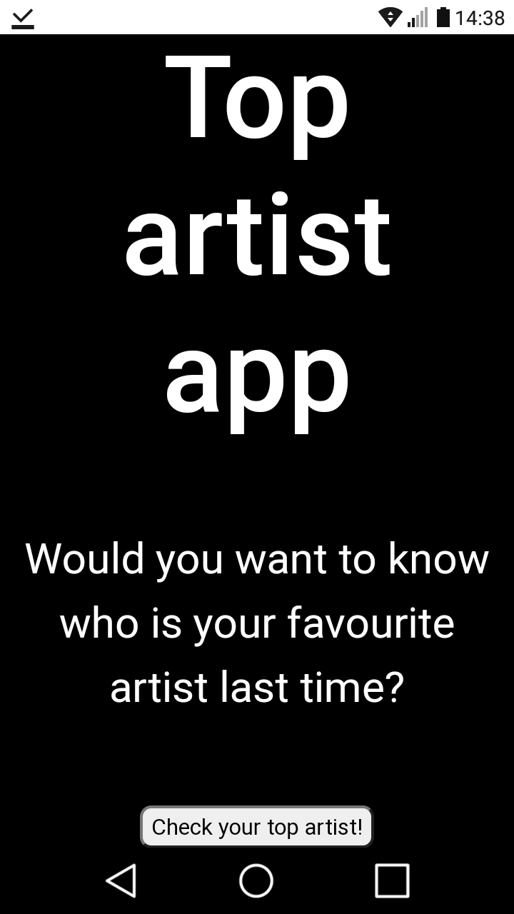
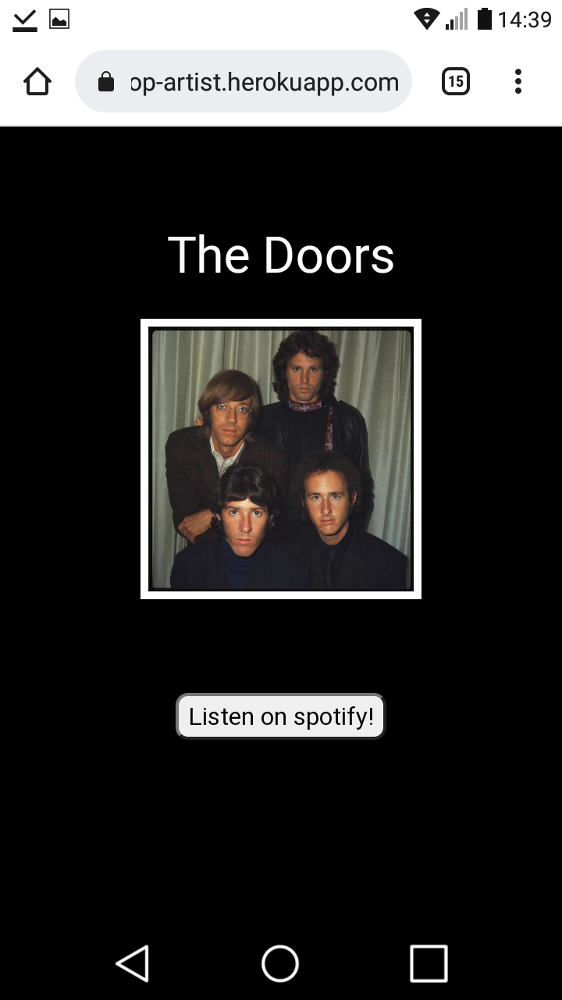

<!--
*** Thanks for checking out the Best-README-Template. If you have a suggestion
*** that would make this better, please fork the repo and create a pull request
*** or simply open an issue with the tag "enhancement".
*** Don't forget to give the project a star!
*** Thanks again! Now go create something AMAZING! :D
-->

<!-- PROJECT SHIELDS -->
<!--
*** I'm using markdown "reference style" links for readability.
*** Reference links are enclosed in brackets [ ] instead of parentheses ( ).
*** See the bottom of this document for the declaration of the reference variables
*** for contributors-url, forks-url, etc. This is an optional, concise syntax you may use.
*** https://www.markdownguide.org/basic-syntax/#reference-style-links
-->

<!-- PROJECT LOGO -->

<h3 align="center">Top artist</h3>

  

    Simple spotify app to show yours top artist
     
    <a href="https://your-top-artist.herokuapp.com/">Try it</a>

  

<!-- TABLE OF CONTENTS -->

  
Table of Contents

  <ol>
    <li>
      <a href="#about-the-project">About The Project</a>
      <ul>
        <li><a href="#built-with">Built With</a></li>
      </ul>
    </li>
    <li>
      <a href="#getting-started">Getting Started</a>
      <ul>
        <li><a href="#prerequisites">Prerequisites</a></li>
        <li><a href="#installation">Installation</a></li>
      </ul>
    </li>
    <li><a href="#usage">Usage</a></li>
    <li><a href="#contact">Contact</a></li>
  </ol>

<!-- ABOUT THE PROJECT -->
## About The Project

A simple web application, enabling users registered on Spotify to display the artist most listened to recently.

IMPORTANT: Since the application is in development mode, Spotify Service only accepts authorization from users who are manually added by developer.
Please contact if you want to try my app

  

  

(<a href="#top">back to top</a>)

### Built With

* [Java 11](https://docs.oracle.com/en/java/javase/11/)
* [Spring boot](https://spring.io/projects/spring-boot)
* [ThymeLeaf](https://www.thymeleaf.org)
* [Bootstrap](https://getbootstrap.com)
* [Heroku](https://www.heroku.com)

(<a href="#top">back to top</a>)

<!-- GETTING STARTED -->
## Getting Started

### Prerequisites

If you want run app, only you need is any device connected with the internet and any web browser.
                                
                               

### Run app

1. Visit webstie: 

  

     
    <a href="https://your-top-artist.herokuapp.com/">

  

  
2. Click : Check your top artist!"
3. Login to your spotify account

(<a href="#top">back to top</a>)

<!-- USAGE EXAMPLES -->
## Usage
Check video demo:
                                 

  

     
    <a href=https://www.youtube.com/watch?v=-SRVXHB-ks0&ab_channel=MaciejJaro%C5%84ski">View Demo</a>

  

<!-- CONTACT -->
## Contact

Maciej Jaroński - maciekjaronski98@gmail.com

Project Link: [https://github.com/MaciekFretka/Video-Transcode](https://github.com/MaciekFretka/Video-Transcoder)

(<a href="#top">back to top</a>)

